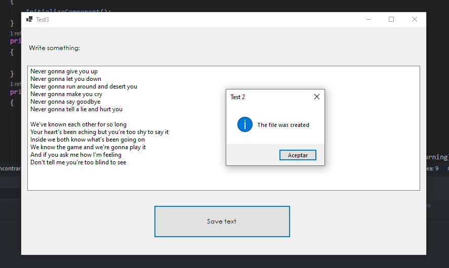
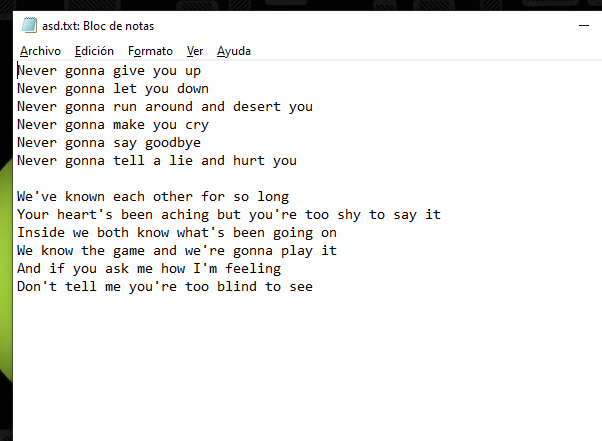

# Test 2
### Tarea:
Crear una aplicación para crear un archivo de texto en un directorio que no existe. Para esto mediante una ventana, el usuario ingresa un texto y al presionar un botón, se guarda un archivo en bytes.

### Resolucion:
Se implemento una interfaz grafica en la cual el usuario escribe texto en un textbox para luego presionar el boton *save* el cual abre un cuadro de dialogo para que el usuario decida donde guardar su archivo.

